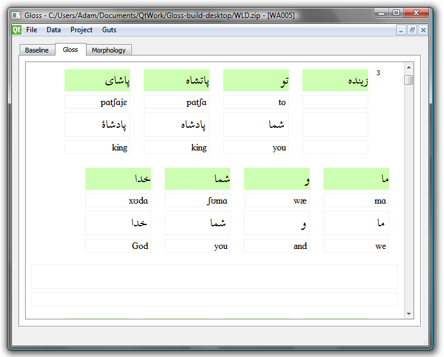

Gloss
-----

Gloss is a tool for interlinear annotation of texts. It arose from my frustration with existing tools, and from my desire to have a tool that works _just right_. I have logged countless hours interlinearizing texts, and Gloss is as efficient a tool as I can create for that purpose.

*   [Gloss User Guide](user-guide/gloss-user-guide.pdf) (PDF, 258 KB)

Features
--------

*   Support for analysis
    *   Efficient transcription and glossing
    *   Easy-as-possible morphological analysis
    *   Basic support for syntactic annotation
    *   Full-featured, fast search capability
*   Open data formats
    *   Lexical information stored in a [SQLite](http://www.sqlite.org/) database.
    *   Texts stored in XML FlexText files.
    *   These two files stored in a (surprisingly compact) zip archive.
*   Speed & efficiency
    *   No appreciable delays in the user interface once the text is loaded.
    *   Efficient switching between baseline and gloss tabs.
    *   Gloss does not get slower the more texts you add in your database.
    *   Working with an interlinear analysis of a 288-line, 2643-word text takes about 104 MB of memory on my computer.
*   Import files
    *   Import glossed files from Language Explorer — Gloss will store the text forms and gloss forms for you. No data lost.
    *   Import ELAN files — Gloss will let you play the intervals associated with the text, just by double-clicking on the line number
    *   Import plain text files (if you tell Gloss which writing system to use)



Origins
-------

Gloss owes a tremendous conceptual debt to [Language Explorer](http://fieldworks.sil.org/flex/), but is also geared toward overcoming Language Explorer's weaknesses. In particular:

*   It is [impossible (or possibly just very awkward)](https://groups.google.com/d/topic/flex-list/zTGrOJYWqL8/discussion) to have separate IPA transcriptions of words with identical orthographic form.
*   Language Explorer [gets slower](http://scholarspace.manoa.hawaii.edu/html/10125/1730/butler.html) the more texts you add.

Cross-platform compatibility & building the source
--------------------------------------------------

Since Gloss is build with the Qt framework, it should work on platforms that Qt supports (Windows, Unix/Linux, Mac). Beyond the Qt libraries, Gloss requires the following external libraries:

*   libexslt
*   libxslt
*   libxml2
*   [libquazip](http://quazip.sourceforge.net/)

The first three dependencies are easily installed:

```
sudo apt-get install libxml2-dev
sudo apt-get install libxslt-dev
```

Quazip is a bit trickier because you need to build the source. (For me, it was necessary to install the “qt4-dev-tools” package in order to build quazip.)

Downloads
---------

Gloss is created with the [Qt application framework](https://www.qt.io/), released under the GNU Public License. That means, among other things, that you are free to download it and use it, but not to re-sell it.

Qt is a cross-platform framework, so there is the possibility for using this on Mac OS X, Linux, etc. Right now I only have Windows executables because I only have a Windows machine. Perhaps some do-gooder will build versions for other operating systems and send them to me.

I build in Windows with this, which assumes that Qt is installed and visible in your path:

```
qmake -config release
mingw32-make
```

Of course your system would have something different from “mingw32-make”—probably just “make”—if you are not building from Windows using MinGW.
